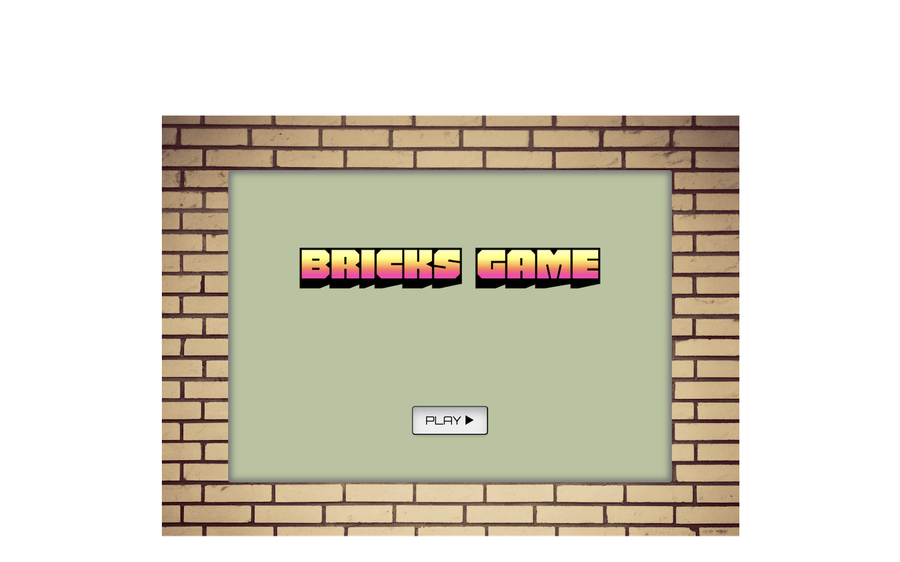
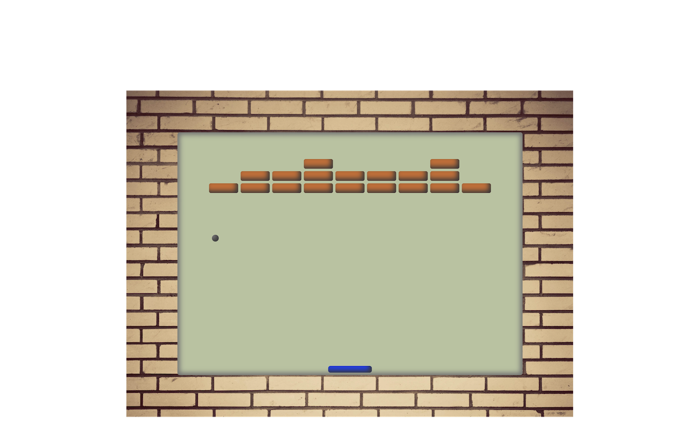

# BRICKS GAME &nbsp;🕹️

## Description:

It is a block breaker game and it is intended to be a very simplified version of the classic Arkanoid video game.

 

## How to play:

The player controls a paddle, moving it from side to side in order to hit a ball into a wall of bricks and destroy them.  
If all bricks have been destroyed, the player wins.  
If the ball touches the bottom edge of the game area, it's game over.

## Demo:

You can see [here](https://nicoanzo.github.io/oop-bricks-game/) the final version of the project.
